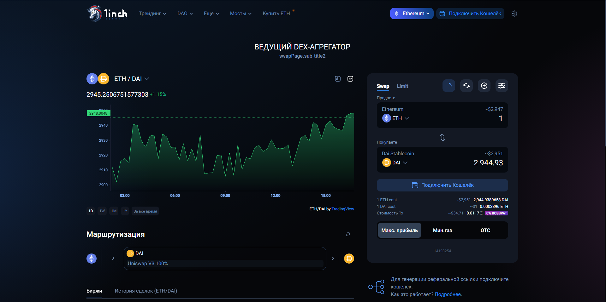
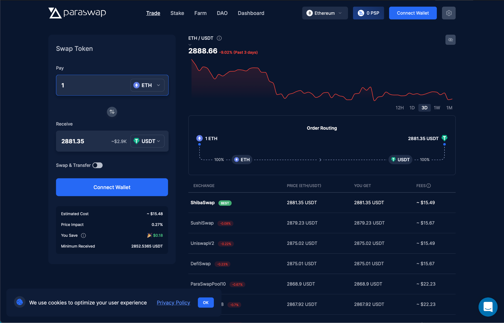
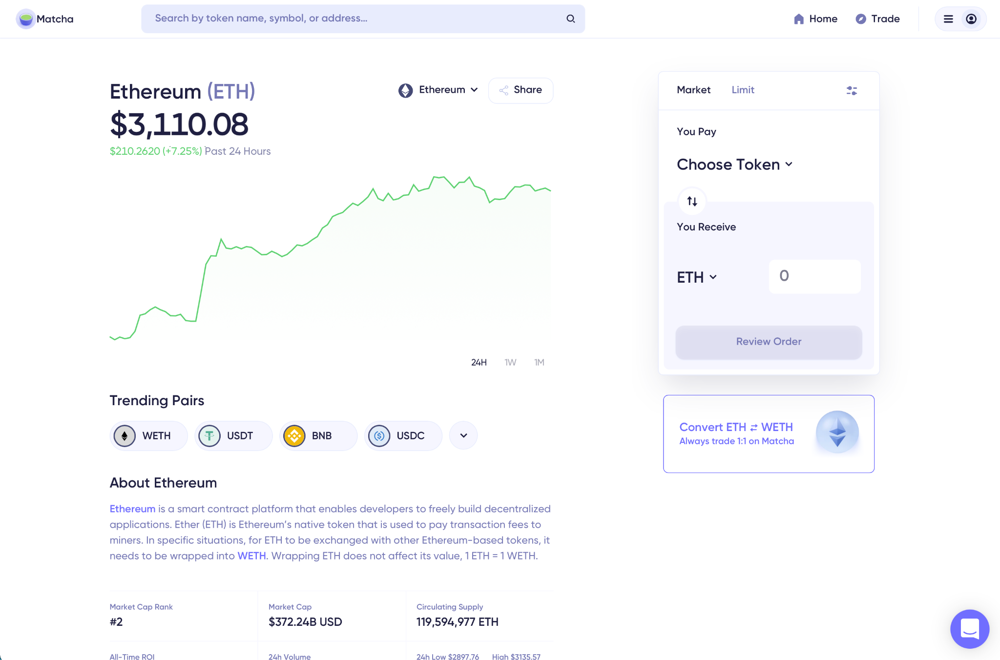
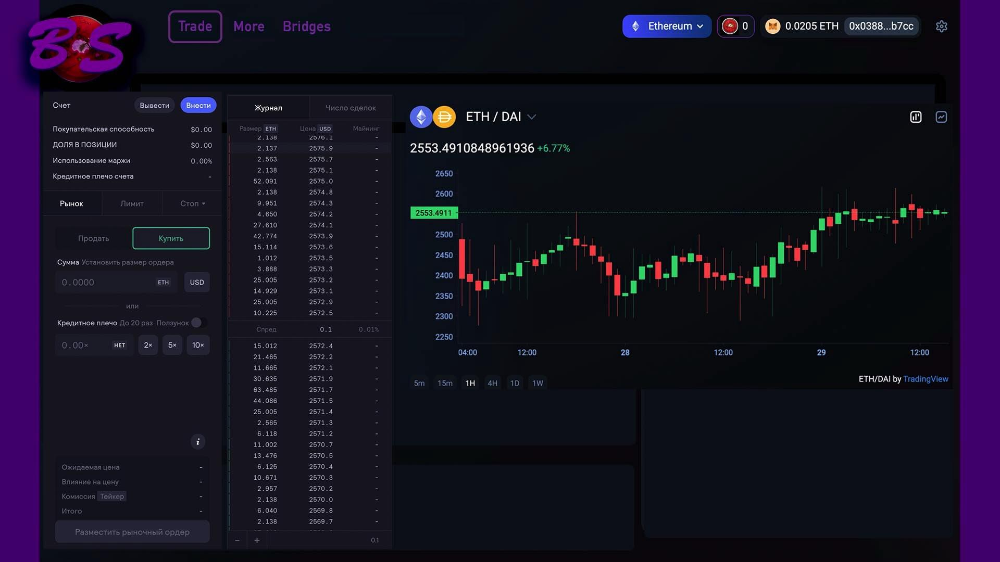
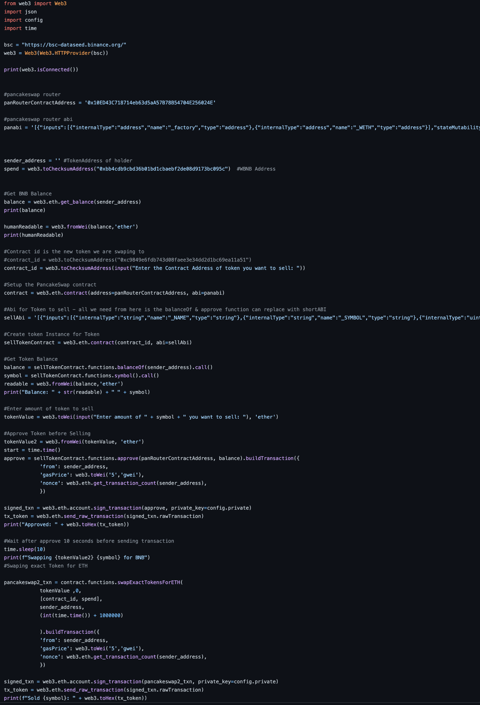
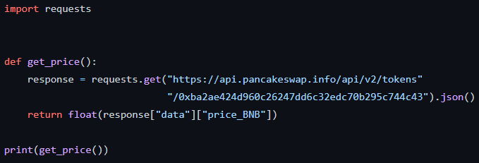

Государственное бюджетное общеобразовательное

учреждение города Москвы \"Школа № 1535\"

**"BorschSwap. Агрегатор для децентрализованных криптобирж(DEX)"**

> **Выполнили:**
>
> **Щербаков Алексей**
>
> **Хорт Матвей**
>
> **Юнда Степан**
>
> **ГБОУ «Школа 1535», 10В класс**
>
> **Научный руководитель:**
>
> **Шехтман Ю.Б., к.п.н.,**
>
> **учитель экономики**

**Москва 2022**

**Оглавление**

[Введение](#введение) **3**

[Актуальность](#актуальность) **4**

[Новизна и анализ рынка](#новизна-и-анализ-рынка) **5**

> [1inch DeFi aggregator](#inch-defi-aggregator) 5
>
> [ParaSwap](#paraswap) 6
>
> [Matcha](#matcha) 6

[Команда проекта](#команда-проекта) **7**

[Цель и задачи проекта](#цель-и-задачи-проекта) **8**

> [Проблема](#проблема) 8
>
> [Цель проекта](#цель-проекта) 8

[Задачи проекта](#задачи-проекта) **8**

[План проекта](#план-проекта) **9**

**[Проектирование](#проектирование) 11**

> [Описание работы приложения](#описание-работы-приложения) 11
>
> [Принцип работы](#принцип-работы) 12
>
> [Агрегирование](#агрегирование) 12
>
> [Серверная часть](#серверная-часть) 12
>
> [Функционал сайта](#функционал-сайта) 12

# Введение

Несколько лет назад большинство из нас даже не знали о существовании
виртуальных валют, а те, кто знал, не верил в их будущую популярность
из-за недоверия к механизмам, стоящим за их выпуском и подкрепленности
их как валюты. Так продолжалось до взлета всем известной монеты Bitcoin.
Тогда не вовлеченные пользователи узнали о криптовалюте как о явлении. В
тот момент рынок неосязаемых платежных средств и начал резкий рост. С
тех пор произошло много изменений в технологиях, стоящих за выпуском
монет, и процессом их обмена. Относительно недавно начали появляться
сервисы облегчающие процесс купли и продажи монет, помогающие войти на
рынок неопытным инвесторам.

# Актуальность

Рассмотрен новый способ коммуникации пользователя и DEX, посредством
агрегатора, который улучшит опыт взаимодействия с рынком новых
пользователей и добавит функционал, необходимый профессионалам.

Мы же создаём инструмент, с помощью которого пользователь сможет удобно
обращаться к таким биржам и который не является центром хранения и не
имеет доступа к криптоактивам пользователя. Такой инструмент позволит
пользователям получать информацию о лучших обменных курсах на самых
разных DEX без необходимости заниматься этим вручную.

Поскольку фундаментом ценности криптовалюты является анонимность и
надежные средства для проведения транзакций, можно сделать вывод, что
развитие децентрализованных бирж неизбежно.

# Новизна и анализ рынка

Первичный анализ рынка и поиск аналогов в интернете показал, что на
данный момент существует несколько агрегаторов, имеющих различный
функционал. Ниже представлен [[анализ поискового
запроса]{.underline}](#_heading=h.44sinio) по данной теме.

Одними из наиболее популярных и с широким функционалам агрегаторов
являются "1inch DeFi aggregator", "ParaSwap", "Matcha".

## 1inch DeFi aggregator

1inch - агрегатор созданный на собственных протоколах ликвидности и
агрегации ("1inch liquidity protocol", "1inch aggregation protocol").
1inch имеет собственный токен "1INCH token", держатели которого могут
участвовать в управлении проектом посредством общего голосования этой
монетой.

{width="6.298966535433071in"
height="3.1527777777777777in"}

Рисунок 1. интерфейс 1inch

## 

## ParaSwap

Каждая транзакция Paraswap показывает пользователю полезную сводку своей
транзакции, включая предполагаемую стоимость, влияние на цену и
минимальное полученное. Также показаны сведения о маршрутизации, которые
помогут пользователям понять путь, по которому прошли их токены.

{width="6.298966535433071in"
height="4.041666666666667in"}

Рисунок 2.ParaSwap - интерфейс.

## Matcha

{width="6.298966535433071in"
height="4.152777777777778in"}

Matcha - это децентрализованная биржа на основе Ethereum, которая
позволяет пользователям обмениваться токенами по лучшим ценам, агрегируя
ликвидность из различных сетей обмена, таких как 0x Mesh, Kyber,
Uniswap, Curve и Oasis.

# Команда проекта

Таблица 1. Команда проекта

+------------+------------+-----------------+--------------------------+
| ФИО        | Должность  | Функция в       | Задачи в проекте         |
|            |            | проекте         |                          |
+============+============+=================+==========================+
| Шехтман    | Учитель    | Научный         | 1\. Организация работы   |
| Юлия       | экономики  | руководитель    | проектной команды.       |
| Борисовна  |            |                 |                          |
|            |            |                 | 2\. Обеспечение          |
|            |            |                 | ресурсами, договорные    |
|            |            |                 | отношения.               |
|            |            |                 |                          |
|            |            |                 | 3\. Разработка           |
|            |            |                 | педагогической           |
|            |            |                 | компоненты проекта.      |
+------------+------------+-----------------+--------------------------+
| Юнда       | Учащийся   | Веб-дизайнер,   | 1\. Разработка           |
| Степан     | 10В класса | специалист по   | визуальной составляющей  |
|            |            | верстке,        | сайта                    |
|            |            | размещению      |                          |
|            |            | сайтов,         | 2\. Помощь в написании   |
|            |            | джуниор -       | документации             |
|            |            | Python          |                          |
|            |            | разработчик     | 3\. Совмещение фронтенда |
|            |            |                 | и бэкенда посредством    |
|            |            |                 | API                      |
+------------+------------+-----------------+--------------------------+
| Хорт       | Учащийся   | Тим-лид,        | 1\. Подготовка теории    |
| Матвей     |            | джуниор -       |                          |
|            | 10В класса | Python          | 2\. Написание            |
|            |            | разработчик,    | документации             |
|            |            | специалист в    |                          |
|            |            | области         | 3\. Размещение сайта в   |
|            |            | торговли        | сети Интернет            |
+------------+------------+-----------------+--------------------------+
| Щербаков   | Учащийся   | Джуниор -       | 1\. Написание алгоритмов |
| Алексей    | 10В класса | Python          | торговли и агрегации     |
|            |            | разработчик,    |                          |
|            |            | Data science    | 2\. Помощь в совмещении  |
|            |            | специалист      | фронтенда и бэкенда      |
+------------+------------+-----------------+--------------------------+

# Цель и задачи проекта

## Проблема

Отсутствие на рынке агрегатора предоставляющего возможность взять
кредитное плечо, выбрав кредитора из пользователей, способных
аккредитовать по наиболее выгодным условиям.

## Цель проекта

Расширить функционал агрегаторов DEX, реализовав систему свободного
займа.

# Задачи проекта

1.  Изучить основы JavaScript, Python, HTML, CSS

2.  Создать сайт

3.  Создать рынок кредитования в условиях DEX

4.  Создать удобный интерфейс

5.  Протестировать агрегатор

6.  Разместить сайт в сети интернет

7.  Апробировать агрегатор среди целевой аудитории

8.  Отладить и доработать код, получив обратную связь

# План проекта

Начало: 1.09.2021 г.

Окончание:

План проекта представлен в таблице 2. Условные обозначения ролей
участников: А -- Алексей Щербаков, С -- Степан Юнда, М - Матвей Хорт, НР
-- научный руководитель

Таблица 2. Календарный план проекта

  ------------------------------------------------------------------------
  № п/п Название этапа                 Сроки реализации  Участники
  ----- ------------------------------ ----------------- -----------------
  1     Подготовка, планирование                         

  1.1   Постановка цели, обсуждение    1.09 -- 20.09     А, С, М, НР
        основной концепции и                             
        технических особенностей                         
        проекта                                          

  1.2   Выбор инструментов разработки  20.09 -- 15.10    А, С, М, НР

  2     Разработка                                       

  2.1   Обсуждение деталей реализации  15.10 -- 30.10    А, С, М, НР

  2.2   Разработка прототипа сайта без 30.10 -- 15.11    С, М
        бэкенда                                          

  2.3   Изучение литературы            15.11 -- 1.12     А, С, М

  2.4   Программирование основных      1.12 -- 5.12      А, М
        алгоритмов проекта                               

  2.5   Написание бэкенда              5.12 -- 10.12     А, М

  2.6   Тестирование различных         16.12             А, М
        вариантов реализации проектов                    

  2.7   Разработана финальная версия   17.12 -- 20.12    С, М
        дизайна агрегатора                               

  2.8   Совмещение фронтенда и бэкенда 10.01 -- 23.01    А, С

  2.9   Финальное тестирование,        23.01 -- 27.01    А, С, М
        введение незначительных                          
        изменений                                        

  3     Подведение итогов, развитие                      

  3.1   Документация и оформление      29.01 -- 01.02    А, С, М, НР
        проекта                                          

  3.2   Создание демонстрационных      01.02 -- 15.02    А, С, М, НР
        материалов                                       

  3.3   Доработка прототипа по         15.02 -- 01.03    А, С, М, НР
        результатам расширенных тестов                   
  ------------------------------------------------------------------------

# Проектирование

## Описание работы приложения

Порядок работы агрегатора можно разбить на четыре этапа:

1)  Пользователь подключает кошелек Metamask к агрегатору

2)  Выбирает валютную пару (рис. 2)

> {width="6.298966535433071in"
> height="3.5416666666666665in"}
>
> Рис. 2. Изображение работы приложения

3)  Агрегатор предоставляет информацию о наилучшем курсе обмена

4)  Сделка перенаправляется на выбранную алгоритмом биржу и
    > регистрируется в блокчейн

> Для достижения поставленной цели необходимо разработать функциональный
> веб-сайт на конструкторе WordPress.

## Принцип работы

Мы разделили проектирование нашего продукта на 4 основные части:

-   Серверная часть (хостинг фронтенда сайта, обработка нажатий каждой
    > кнопки

-   Фронтенд (графическое оформление сайта)

-   Алгоритм агрегирования (алгоритм поиска лучшего разделения
    > транзакции между биржами для обеспечения более низкой цены и
    > увеличения скорости сделки)

-   Реализация маржинальной торговли с помощью смарт контрактов.

## Агрегирование

> Пока что, у агрегатора 1inch самая лучшая формула для агрегирования,
> поэтому мы будем использовать только ее.
>
> [[https://wolfdefi.com/projects/1-inch-python-trades/]{.underline}](https://wolfdefi.com/projects/1-inch-python-trades/)

Подробнее см. в приложении 1.

## Серверная часть

В данной части проекта необходимо реализовать сервер на фреймворке
Flask, так как он является очень простым в изучении и реализации.
[[https://itproger.com/course/flask]{.underline}](https://itproger.com/course/flask)

## Функционал сайта

1)  В левом верхнем углу расположен логотип агрегатора, являющийся
    > ссылкой на домашний экран

2)  В шапке сайта расположено три окна:

> а)"Trade" - ссылка на окно с обменником и графиками валютных пар
>
> б)"More" - ссылка на окно с информацией о агрегаторе
>
> с)"Bridges" - ссылка на "мосты" между сетями («мост» обеспечивает
> возможность блокчейн-обмена сторонних криптовалют на нативные токены)

3)  В правой части шапки расположено окно с выбором сети и окно с
    > аккаунтом Metamask

4)  Слева находится интерфейс покупки / продажи валюты

5)  Справа расположен график показывающий изменения цены валютной пары

{width="6.298966535433071in"
height="3.5416666666666665in"}

> Рисунок 5. BorschSwap - интерфейс

6.  **Маржинальная торговля**

Чтобы понять, как будет реализована маржинальная торговля, необходимо
разобраться, что такое смарт контракты.

Смарт-контракт --- это самоисполняющийся контракт, в котором условия
соглашения между покупателем и продавцом записываются непосредственно в
строки кода. Код и содержащиеся в нем соглашения существуют в
распределенной децентрализованной сети блокчейнов . Код контролирует
выполнение, а транзакции отслеживаются и необратимы.

Смарт-контракты позволяют выполнять доверенные транзакции и соглашения
между разрозненными анонимными сторонами без необходимости в центральном
органе, правовой системе или внешнем принудительном механизме.

Однако технология смарт-контрактов уже далеко вышла за рамки
подтверждения простых транзакций. Например, электронное голосование. (
[[https://github.com/andresudi/Voting-Smart-Contract]{.underline}](https://github.com/andresudi/Voting-Smart-Contract)
).

Когда вы торгуете на централизованных биржах (CEX), вы подключаетесь к
рынку через посредника (биржу), ваши деньги будут управляться биржей
(кастодиальной), хотите вы этого или нет. Из-за такой централизованной
модели биржи CEX часто становятся главной целью для атак хакеров.

Даже самые популярные CEX в отрасли были взломаны, поэтому я не думаю,
что проблема в том, «была ли эта биржа взломана или нет?» но когда?\".
Помимо проблем с безопасностью, у биржи CEX также есть проблемы,
связанные с мошенничеством пользователей.

Margin DEX был создан для решения большинства вышеперечисленных проблем:

Безнадежность: пользователи имеют доступ к рынку без посредника.

Без хранения: пользователи смогут контролировать и управлять своими
собственными активами, и им не нужно вносить их на хранение какой-либо
стороне.

Прозрачность: все будет работать через смарт-контракт на Ethereum и в
будущем будет управляться DAO.

Без разрешений: любой, в любом месте и в любое время может получить
доступ и использовать платформу Perpetual Protocol без ограничения
разрешений кем-либо.

Теперь о том, что такое маржинальная торговля.

Суть маржинальной торговли заключается в том, что трейдер (клиент
компании), получает от брокера определенный кредит для покупки активов.
При этом, клиент оставляет определенную сумму залога, которая может быть
равна минимальному депозиту у брокера или любой сумме, которая превышает
его. Собственно, обеспечением кредита и является депозит трейдера.

Несмотря на то, что брокеры и дилинговые центры кредитуют трейдеров на
значительные суммы, они не склонны терять свои деньги. Соответственно,
при открытии позиции и движении рынка против прогноза, вся полнота
рисков возлагается исключительно на средства трейдера, в то время как
средства брокера остаются «замороженными» в сделке.

Как уже говорилось ранее, реализовывать маржинальную торговлю мы будем
через смарт контракты. Когда кредитор и трейдер подписывают контракт,
средства кредитора и трейдера замораживаются до выхода из сделки или
маржин кола, и не могут быть никуда переведены. Реализация расположена
по ссылке ниже:

[[https://github.com/dydxprotocol/solo]{.underline}](https://github.com/dydxprotocol/solo)

7.  **Разработка бэкенда**

Первоначально мы решили найти два скрипта, позволяющие выводить цену на
валюту онлайн и совершать сделки через указанную биржу.

> {width="3.982508748906387in"
> height="5.834374453193351in"}

Рисунок 7- алгоритм покупки валюты.

> Второй скрипт позволял совершать сделки через указанную биржу в
> необходимом объеме
> {width="6.298966535433071in"
> height="2.138888888888889in"}

[]{#_heading=h.44sinio .anchor}**Список источников и использованной
литературы**

1)  Обзор платформы ParaSwap-- Режим доступа: URL:
    > https://defiprime.com/product/paraswap

2)  1inch на Eth Optimistic. -- Режим доступа: URL:
    > [[https://www.coindesk.com/tech/2021/08/17/defis-1inch-network-launches-on-ethereum-scaling-platform-optimism/]{.underline}](https://www.coindesk.com/tech/2021/08/17/defis-1inch-network-launches-on-ethereum-scaling-platform-optimism/)
    > (дата обращения: 3.11.2021).

3)  Используемые книги:

-   Decentralized Exchanges (DEX) with Automated Market Maker (AMM)
    > Protocols \[Электронный ресурс\]. -- Режим доступа: URL:
    > [[https://arxiv.org/pdf/2103.12732.pdf]{.underline}](https://arxiv.org/pdf/2103.12732.pdf)

-   DApp for the Decentralized Marketplace \[Электронный ресурс\]. --
    > Режим доступа: URL:
    > [[https://www.researchgate.net/publication/340653653_DEX_A\_DApp_for_the_Decentralized_Marketplace]{.underline}](https://www.researchgate.net/publication/340653653_DEX_A_DApp_for_the_Decentralized_Marketplace)

-   Decentralized Exchanges \[Электронный ресурс\]. -- Режим доступа:
    > URL:
    > [[https://www.snb.ch/n/mmr/reference/sem_2021_05_20_lehar/source/sem_2021_05_20_lehar.n.pdf]{.underline}](https://www.snb.ch/n/mmr/reference/sem_2021_05_20_lehar/source/sem_2021_05_20_lehar.n.pdf)
